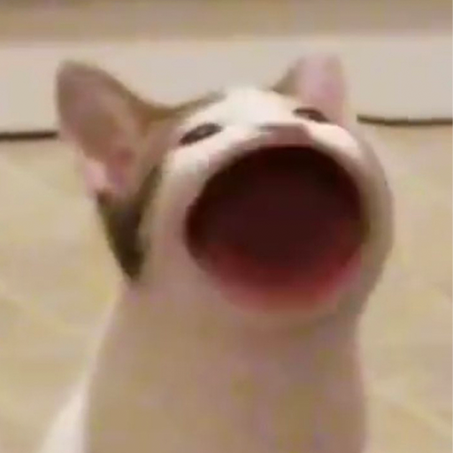
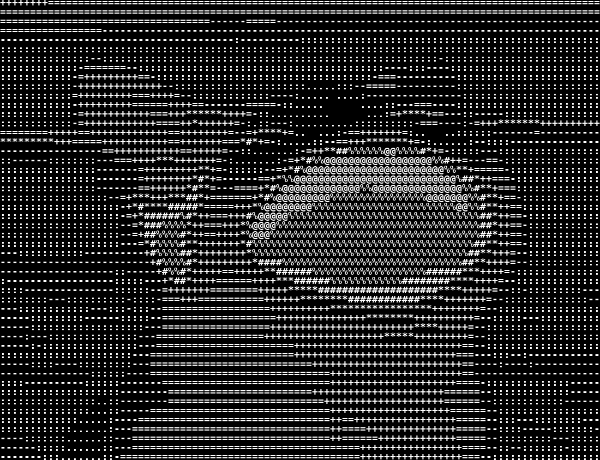

# ASCII Art Generator
ACM Open Projects: ASCII Art Generator

## Preview

ASCII Art is generated by using ascii charecters, by replacing images color data with similar intesity of a ascii charecter. Here's an example of ascii art of `pop cat`. 
<div align="center">
  
  
</div>

[Video Demo](https://user-images.githubusercontent.com/74976752/174677109-cacf9953-3cb1-4fab-a972-7f7ed868a7ff.mp4) :
<div align="center" width="30%">


  
</div>

## Runnig the code
To run the demo, Follow the following steps:
```
git clone https://github.com/xtanion/ACM-asciified
```
Install the reuired packages:
```
pip install requirements.txt
```
**ASCII Images :**
Execute the python file `ascii_text.py` to generate `.png` ascii art of any image. You can choose between different modes `standard`, `inverse` and `complex`.
You can find the generated image in `tmp/` directory.

**ASCII Videos**
Run the python file `ascii_vid.py` to see the ASCIIfied video prview.
